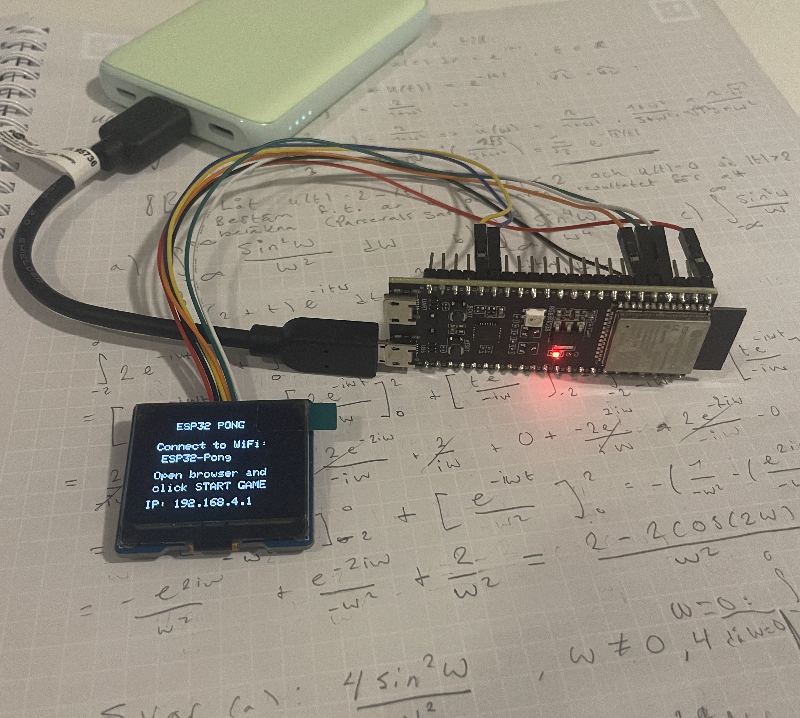
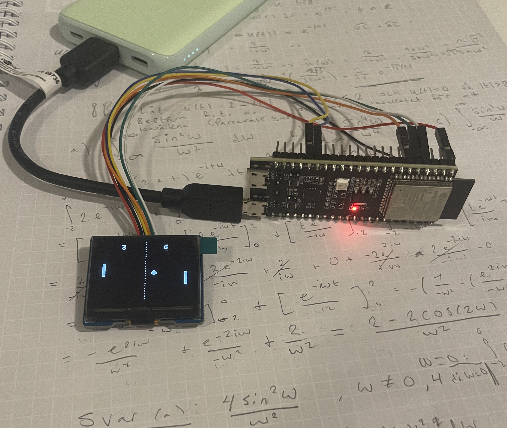

## Esp32 wifi pong

Embedded wireless pong with SPI, Wi-Fi communication and OLED peripheral in C++.
Full wireless architecture combining ESP32 Access Point mode with web server + real time WebSocket controller.

## Hardware

**Microcontroller:**
- ESP32-S3-DevKitC, 8 MB Flash, 8 MB PSRAM

**OLED Screen:**
- 128 x 96 pixels (SSD1327)

**Pin Definitions:**
| Pin | Function |
|-----|----------|
| 6   | OLED_CS  |
| 5   | OLED_DC  |
| 4   | OLED_RST |
| 11  | OLED_MOSI|
| 12  | OLED_SCLK|

<table>
  <tr>
    <td></td>
    <td></td>
  </tr>
</table>

<table>
  <tr>
    <td></td>
    <td></td>
  </tr>
</table>

## Setup Instructions

1. Clone this repository
2. Check if ESP32-S3 is on port COM3, otherwise change in `platformio.ini`
3. Build and upload firmware: `pio run -t upload`
4. Upload data files to SPIFFS: `pio run -t uploadfs`

## Library Dependencies

- Adafruit GFX Library
- Adafruit SSD1327
- links2004 WebSockets
