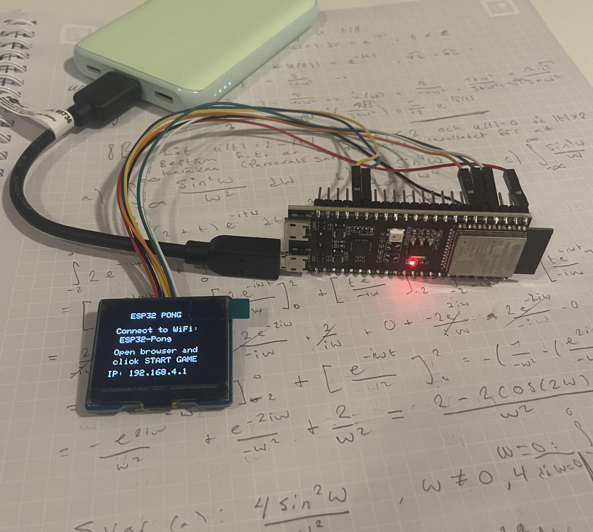
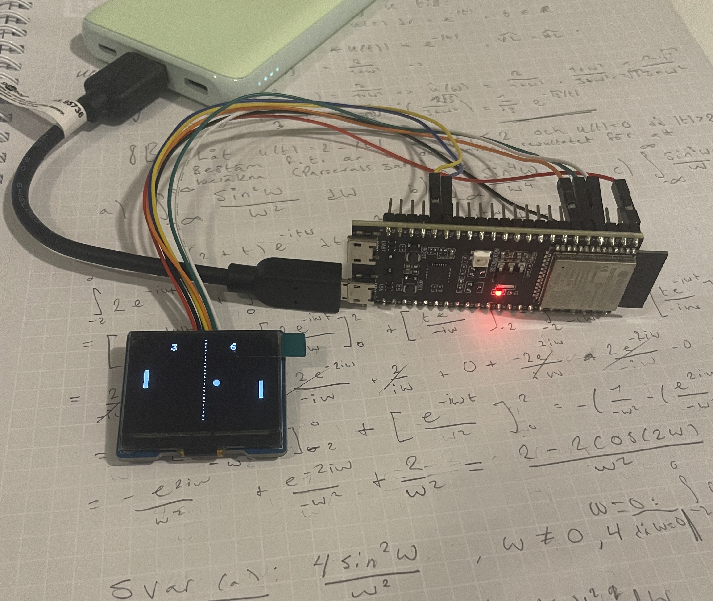
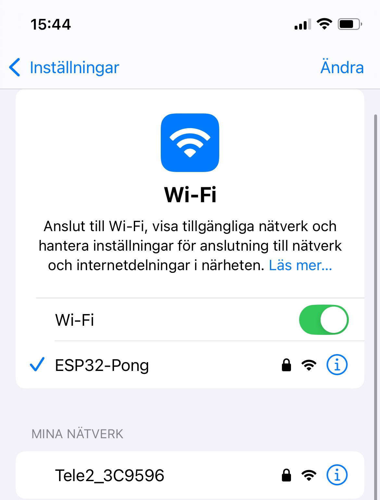
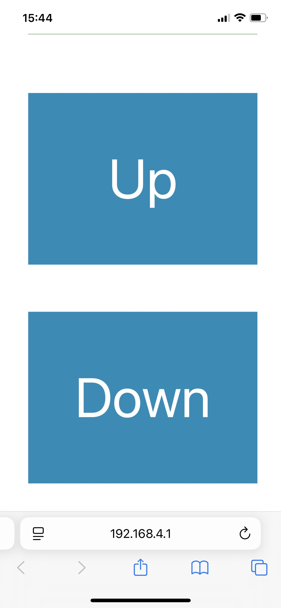

# ESP32 Wi-Fi GameBox 🎮

A wireless, self-contained **multi-game console** running on an **ESP32-S3** with an
**SSD1327 grayscale OLED**. The ESP32 hosts its own Wi-Fi network and serves a web
controller that **reshapes itself per game** — pick a game from the on-device menu and
your phone morphs into the right control surface. No app install required.

Grew out of a single-game Pong firmware into a small game engine (see
[`CLAUDE.md`](CLAUDE.md) for the architecture & migration notes).

## 🕹️ Games

| Game  | Players | Controller            | How it plays |
|-------|---------|-----------------------|--------------|
| **Pong**  | 1 | Up / Down + Menu       | Classic paddle vs adaptive AI; first to 3 |
| **Snake** | 1 | 4-way arrows           | Eat food, grow, don't bite yourself or the walls |
| **Racer** | 1 | Tilt (+ Left/Right)    | Top-down dodge-the-traffic; **tilt your phone** to steer |
| **Tron**  | 2 | Left / Right turns     | Two light-cycles, two trail shades; last one riding wins |

Single-player games end on a crash (your score is your distance/length). Tron needs **two
phones connected** — selecting it shows a "waiting for players" screen until the second
phone joins, and a mid-round disconnect awards the round to the remaining rider.

## 🛠️ Hardware Requirements

- **ESP32-S3** development board (8 MB flash; uses a custom partition table)
- **SSD1327 OLED display** (128×128 panel, top 128×96 used, 4-bit grayscale, SPI)
- Jumper wires

## 📺 Display Wiring (SPI)

| SSD1327 Pin | ESP32-S3 GPIO |
|-------------|---------------|
| CS          | GPIO 6        |
| DC          | GPIO 5        |
| RST         | GPIO 4        |
| MOSI (SDA)  | GPIO 11       |
| SCLK (SCL)  | GPIO 12       |
| VCC         | 3.3V          |
| GND         | GND           |

Pins live in [`main/hw_config.h`](main/hw_config.h).

<table>
  <tr>
    <td></td>
    <td></td>
  </tr>
</table>

<table>
  <tr>
    <td></td>
    <td></td>
  </tr>
</table>

## 📡 How It Works

1. **Power on** the ESP32 — it creates a Wi-Fi access point (`ESP32-Pong`, pw `12345678`).
2. **Connect** your phone/laptop to that network. The OLED shows the SSID and the IP.
3. **Open a browser** at `http://192.168.4.1`.
4. **Navigate the menu** with Up/Down + SELECT on the phone; the OLED highlights the choice.
5. **Play!** The phone swaps to that game's controls automatically. MENU returns you.

## 🧱 Architecture

```
                 ┌───────────────────────────────────────────────┐
                 │                  engine.c                       │
                 │  app state machine: MENU / PLAYING / GAMEOVER   │
                 │  game registry[] + active-game vtable pointer   │
                 │  engine_update(dt) → active->tick / is_over     │
                 │  engine_dispatch_input(event) → menu or game    │
                 └───────┬───────────────────────────┬────────────┘
                         │ game_module_t vtable        │ gfx_* primitives
        ┌────────────────┴────────────┐        ┌───────┴───────────────┐
        │ pong / snake / racer / tron  │  draws │   display.c (gfx_*)    │
        │ each owns its state file-     │ ─────► │  SSD1327 driver + FB   │
        │ static; no global game struct │        │  (no game knowledge)   │
        └────────────────▲─────────────┘        └────────────────────────┘
                         │ generic input_event_t
                 ┌───────┴─────────────────┐
                 │        network.c          │
                 │  WS JSON → input_event    │
                 │  fd→player slot mapping   │
                 │  ws_broadcast() (server→  │
                 │  client: welcome/active/  │
                 │  waiting/over)            │
                 └───────────────────────────┘
```

- A **game is one `game_module_t` vtable** (`reset` / `on_input` / `tick` / `render` /
  `is_over` / `winner`) defined in its own `.c`, with all mutable state file-static.
- **`display.c` knows nothing about games** — it exposes generic `gfx_*` primitives
  (`gfx_clear/pixel/rect/circle/text`, `display_present`). The engine draws the menu &
  game-over card; each game draws its own world.
- **One mutex** (`s_engine_mutex`) guards the active game. The engine takes it around
  `tick`/`on_input`, so games never lock. Renderers read unlocked (one torn frame is OK).
- **Input is generic.** `network.c` parses the WS JSON into an `input_event_t`
  (`kind`, `player`, `analog`) and hands it to the engine — no game-specific parsing.

## 🔌 WebSocket Protocol

Small flat JSON over `/ws`. `t` = message type.

**Client → Server**

| `t` | Fields | Meaning |
|-----|--------|---------|
| `hello`  | —                          | sent on connect; server replies `welcome` |
| `nav`    | `dir`: `-1` / `1`          | move menu highlight |
| `select` | —                          | launch highlighted game / play again |
| `back`   | —                          | return to menu / dismiss game-over |
| `input`  | `ev`: `up`/`down`/`left`/`right`/`primary` | discrete game input |
| `tilt`   | `g`: float (degrees)       | analog steering (Racer) |

**Server → Client**

| `t` | Fields | Meaning |
|-----|--------|---------|
| `welcome` | `player`: 0/1            | assigned player slot |
| `active`  | `game`: id, `players`: n | a game launched → **phone morphs its controls** |
| `waiting` | `need`: n, `have`: n     | 2-player game waiting for the second phone |
| `over`    | `winner`: -1/0/1         | round ended (-1 = none/draw) |

The `active` message is what drives the controller morph — the phone JS swaps its control
surface based on `game`. The web controller keeps an exponential-backoff reconnect and
buzzes (`navigator.vibrate`) on round end.

## 📂 Project Structure

```
ESP32-Wi-Fi-Pong/
├── main/
│   ├── main.c           # app_main: init display/engine/network; engine game loop
│   ├── engine.c/.h      # app state machine, game registry, input dispatch, mutex
│   ├── game_module.h    # game_module_t vtable + generic input_event_t
│   ├── pong.c/.h        # Pong module (paddle, ball, adaptive AI)
│   ├── snake.c/.h       # Snake module
│   ├── racer.c/.h       # Tilt racer module
│   ├── tron.c/.h        # Two-player Tron module
│   ├── display.c/.h     # SSD1327 driver + game-agnostic gfx_* primitives
│   ├── network.c/.h     # SoftAP + HTTP + WebSocket parse / broadcast
│   ├── hw_config.h      # Pins / screen / SPI host
│   ├── net_config.h     # Wi-Fi SSID/PW, max WS clients, SPIFFS path
│   └── CMakeLists.txt   # Component build configuration
├── spiffs_image/
│   └── index.html       # Morphing web controller (menu + per-game surfaces + tilt)
├── CMakeLists.txt       # Project build configuration
├── partitions.csv       # Custom partition table (with SPIFFS)
└── sdkconfig            # ESP-IDF configuration
```

Per-game tuning lives in each game's own `.c` (e.g. paddle speed in `pong.c`, step rate in
`snake.c`/`tron.c`) — the headers stay free of Pong-specific constants.

## 🚀 Building & Flashing

1. **Install ESP-IDF** (v6.0; the project targets ESP32-S3).
2. **Set up the environment:**
   ```bash
   source $IDF_PATH/export.sh
   ```
3. **Build, flash & monitor:**
   ```bash
   idf.py build flash monitor
   ```

The web controller (`spiffs_image/index.html`) is packed into the `storage` SPIFFS
partition automatically during the build.

## ✋ Tilt on iOS

iOS Safari requires a user gesture before granting motion access. On the Racer screen tap
**"ENABLE TILT"** once — it calls `DeviceOrientationEvent.requestPermission()` and then
streams throttled (~25 Hz) `tilt` messages. On Android / desktop tilt arms immediately; the
Left/Right buttons always work as a fallback.
